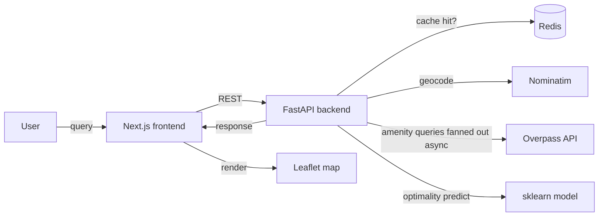

# Optipoint

> **AI-powered location intelligence** — find optimal places to live by combining natural language queries, OpenStreetMap geospatial data, and machine learning.

**Live demo:** [optipoint.vercel.app](https://optipoint.vercel.app) · **API:** [optipoint-api.onrender.com/docs](https://optipoint-api.onrender.com/docs)

 <!-- TODO: add diagram -->

---

## Table of contents

1. [What it does](#what-it-does)
2. [Tech stack](#tech-stack)
3. [Architecture](#architecture)
4. [Project structure](#project-structure)
5. [Quick start (local)](#quick-start-local)
6. [API reference](#api-reference)
7. [Implementation roadmap](#implementation-roadmap)
8. [Deployment](#deployment)
9. [Development workflow](#development-workflow)
10. [Known issues](#known-issues)

---

## What it does

Optipoint takes a natural-language query like *"find me an apartment near a hospital and supermarket in Pune"* and returns a ranked list of housing options scored by their proximity to the amenities you care about. It ships three complementary tools:

| Feature | Input | Output |
|---|---|---|
| **Apartment Finder** | Free-text query | Ranked list of nearby apartments with a weighted optimality score + interactive map |
| **Optimality Predictor** | Location name | ML-based "Optimal / Not Optimal" verdict with distances to 16 amenity categories |
| **Amenity Finder** | Location + amenity type + radius | Distance-sorted list of matching amenities plotted on a map |

---

## Tech stack

**Backend:** Python 3.9+, FastAPI (target) / Flask (current), spaCy (`en_core_web_sm`), scikit-learn, geopy, httpx, Redis (cache)
**Frontend:** Next.js 14 (target) / vanilla HTML (current), Leaflet, Tailwind CSS, TypeScript
**Data:** OpenStreetMap via [Overpass API](https://overpass-api.de/), Nominatim geocoding
**Infra:** Docker, GitHub Actions CI, Render (API), Vercel (web)

---

## Architecture



**Request flow for `/predict/apartment`:**

1. spaCy parses query → extracts location tokens + amenity preferences
2. Nominatim geocodes location → `(lat, lon)`
3. Overpass returns apartments within radius
4. For each apartment, 16 amenity categories are queried **in parallel** via `httpx.AsyncClient`
5. Each response is cached in Redis with a 24h TTL
6. Weighted distance score computed → sorted → returned as JSON
7. Frontend renders results on a Leaflet map

---

## Project structure

**Current (v1 — needs consolidation):**
```
optipoint/
├── app.py                              # Flask app on :5000 — apartment finder
├── amenity_finder.py                   # Flask app on :5001 — amenity search
├── optimality_prediction.py            # Flask app on :5002 — ML classifier
├── final_university_with_distances.csv # training data (43 rows)
└── frontend/                           # 6 vanilla HTML pages
    ├── index.html
    ├── about.html
    ├── amenity-finder.html
    ├── optimality-prediction.html
    ├── nearestlocations.html           # generated by backend
    └── amenities_map.html              # generated by backend
```

**Target (v2):**
```
optipoint/
├── backend/
│   ├── app/
│   │   ├── main.py                     # FastAPI entrypoint
│   │   ├── config.py                   # settings via pydantic-settings
│   │   ├── routers/
│   │   │   ├── apartments.py           # POST /api/apartments/search
│   │   │   ├── amenities.py            # POST /api/amenities/nearby
│   │   │   └── optimality.py           # POST /api/optimality/predict
│   │   ├── services/
│   │   │   ├── geocoding.py            # Nominatim wrapper
│   │   │   ├── overpass.py             # async Overpass client + cache
│   │   │   ├── nlp.py                  # spaCy location/amenity extraction
│   │   │   └── scoring.py              # weighted distance scoring
│   │   ├── ml/
│   │   │   ├── train.py                # one-off training script
│   │   │   ├── predict.py              # inference wrapper
│   │   │   └── model.pkl               # persisted model
│   │   └── schemas.py                  # Pydantic request/response models
│   ├── tests/
│   │   ├── test_scoring.py
│   │   ├── test_nlp.py
│   │   └── test_api.py
│   ├── data/
│   │   └── universities.csv
│   ├── Dockerfile
│   ├── requirements.txt
│   └── pyproject.toml
├── web/
│   ├── app/                            # Next.js app router
│   │   ├── page.tsx                    # landing
│   │   ├── apartments/page.tsx
│   │   ├── amenities/page.tsx
│   │   └── optimality/page.tsx
│   ├── components/
│   │   ├── Map.tsx                     # Leaflet wrapper
│   │   ├── Navbar.tsx
│   │   └── ScoreCard.tsx
│   ├── lib/
│   │   └── api.ts                      # typed API client
│   ├── Dockerfile
│   ├── package.json
│   └── tailwind.config.ts
├── .github/workflows/
│   ├── backend-ci.yml                  # pytest + ruff + mypy
│   └── web-ci.yml                      # vitest + eslint + tsc
├── docker-compose.yml                  # backend + redis + web
├── .gitignore
└── README.md
```

---

## Quick start (local)

### Prerequisites
- Python 3.9+
- Node.js 18+ (for v2 frontend)
- Docker + Docker Compose (optional but recommended)
- Redis (or use Docker Compose)

### Option A — Docker Compose (recommended for v2)
```bash
docker compose up --build
# Backend: http://localhost:8000/docs
# Frontend: http://localhost:3000
```

### Option B — Running v1 as-is
```bash
python -m venv .venv
source .venv/bin/activate
pip install -r requirements.txt
python -m spacy download en_core_web_sm

# Run each Flask app in a separate terminal:
python app.py                    # :5000
python amenity_finder.py         # :5001
python optimality_prediction.py  # :5002

# Serve frontend (pick one):
cd frontend && python -m http.server 8080
```

### Option C — Running v2 locally (post-migration)
```bash
# Backend
cd backend
python -m venv .venv && source .venv/bin/activate
pip install -r requirements.txt
python -m spacy download en_core_web_sm
uvicorn app.main:app --reload --port 8000

# Frontend (separate terminal)
cd web
npm install
npm run dev
```

### Environment variables
Create `backend/.env`:
```
REDIS_URL=redis://localhost:6379/0
OVERPASS_URL=https://overpass-api.de/api/interpreter
NOMINATIM_USER_AGENT=optipoint-dev
CACHE_TTL_SECONDS=86400
CORS_ORIGINS=http://localhost:3000
```

Create `web/.env.local`:
```
NEXT_PUBLIC_API_URL=http://localhost:8000
```

---

## API reference

### `POST /api/apartments/search`
Rank nearby apartments against a natural-language query.

**Request:**
```json
{
  "query": "apartment near hospital and supermarket in Pune",
  "radius_m": 1100
}
```

**Response:**
```json
{
  "origin": { "lat": 18.5204, "lon": 73.8567 },
  "apartments": [
    {
      "name": "Ravet Heights",
      "lat": 18.5298,
      "lon": 73.8601,
      "distance_km": 0.87,
      "score": 0.0142,
      "nearest_amenities": {
        "hospital": { "name": "Ruby Hall", "distance_km": 1.2 },
        "supermarket": { "name": "DMart", "distance_km": 0.6 }
      }
    }
  ]
}
```

### `POST /api/amenities/nearby`
```json
{ "location": "Pune", "amenity_type": "hospital", "radius_m": 5000 }
```

### `POST /api/optimality/predict`
```json
{ "location": "Jadavpur University" }
```
Response: `{ "verdict": "Optimal", "confidence": 0.83, "distances": { ... } }`

Full OpenAPI spec auto-generated at `http://localhost:8000/docs`.

---

## Implementation roadmap

Work through these in order. Each tier is a shippable milestone.

### Tier 1 — Foundation (Week 1) — **deploy-ready**

- [ ] **Write `requirements.txt`** from current imports:
  ```
  fastapi==0.115.*
  uvicorn[standard]==0.32.*
  pydantic-settings==2.*
  httpx==0.27.*
  geopy==2.4.*
  spacy==3.7.*
  scikit-learn==1.5.*
  pandas==2.2.*
  redis==5.*
  folium==0.17.*        # keep during migration, drop later
  python-dotenv==1.*
  ```
- [ ] **Write `.gitignore`**:
  ```
  .venv/
  __pycache__/
  *.pyc
  .env
  .env.local
  node_modules/
  .next/
  .DS_Store
  *.pkl
  ```
- [ ] **Remove `.venv/` from tracking**: `git rm -r --cached backend/.venv`
- [ ] **Consolidate Flask apps** → single FastAPI app. Move each `@app.route` into a router module. Shared helpers (`geocode_location`, `categories_map`) live in `services/`.
- [ ] **Write `backend/Dockerfile`** (multi-stage, slim base):
  ```dockerfile
  FROM python:3.11-slim AS builder
  WORKDIR /app
  COPY requirements.txt .
  RUN pip install --user -r requirements.txt
  RUN python -m spacy download en_core_web_sm

  FROM python:3.11-slim
  WORKDIR /app
  COPY --from=builder /root/.local /root/.local
  COPY app/ ./app/
  COPY data/ ./data/
  ENV PATH=/root/.local/bin:$PATH
  EXPOSE 8000
  CMD ["uvicorn", "app.main:app", "--host", "0.0.0.0", "--port", "8000"]
  ```
- [ ] **Write `docker-compose.yml`** with `api`, `redis`, `web` services.
- [ ] **Deploy backend** to Render (free tier) — connect GitHub, set env vars, done.
- [ ] **Deploy frontend** to Vercel — one-click from GitHub.
- [ ] **Update README** with the live demo URL at the top.

### Tier 2 — Engineering signal (Week 2) — **hireable**

- [ ] **Add Redis caching** for Overpass responses. Pattern:
  ```python
  # backend/app/services/overpass.py
  async def query(category: str, lat: float, lon: float, radius: int) -> list[dict]:
      key = f"overpass:{category}:{lat:.4f}:{lon:.4f}:{radius}"
      if cached := await redis.get(key):
          return json.loads(cached)
      async with httpx.AsyncClient(timeout=30) as client:
          resp = await client.get(OVERPASS_URL, params={"data": _build_query(...)})
      data = resp.json().get("elements", [])
      await redis.setex(key, CACHE_TTL, json.dumps(data))
      return data
  ```
- [ ] **Fan out Overpass calls in parallel** — replace the sequential loop in [app.py:187-202](app.py#L187-L202) with `asyncio.gather`. Expected impact: ~15× latency reduction on cold requests.
- [ ] **Write tests** (target: 15–20 tests):
  - `test_scoring.py` — weighted distance math, score ordering
  - `test_nlp.py` — location/amenity extraction from sample queries
  - `test_overpass.py` — mocked HTTP + cache hit/miss paths
  - `test_api.py` — FastAPI `TestClient` happy paths for all 3 endpoints
- [ ] **Add GitHub Actions** (`.github/workflows/backend-ci.yml`):
  ```yaml
  name: backend-ci
  on: [push, pull_request]
  jobs:
    test:
      runs-on: ubuntu-latest
      steps:
        - uses: actions/checkout@v4
        - uses: actions/setup-python@v5
          with: { python-version: "3.11" }
        - run: pip install -r backend/requirements.txt
        - run: python -m spacy download en_core_web_sm
        - run: ruff check backend/
        - run: mypy backend/app
        - run: pytest backend/tests -v
  ```
- [ ] **Structured logging** — replace `print()` with `structlog` JSON logs.
- [ ] **Add `/health` endpoint** returning `{ status, redis, overpass_reachable }`.
- [ ] **Rate-limit** public endpoints with `slowapi` (e.g. 30 req/min/IP).

### Tier 3 — Differentiation (Week 3+) — **standout**

- [ ] **Rebuild frontend in Next.js 14 + TS + Tailwind + Leaflet.** Delete the six `.html` files. Generate maps client-side from JSON — stop writing HTML files from the backend ([app.py:245](app.py#L245)).
- [ ] **Typed API client** in [web/lib/api.ts](web/lib/api.ts) using `zod` to validate responses.
- [ ] **Add query history** — Postgres + Prisma/SQLAlchemy. Anonymous sessions, no auth needed.
- [ ] **Improve NLP**: spaCy `EntityRuler` + synonym map (`doc` → hospital, `groceries` → supermarket). Optionally an LLM fallback for ambiguous queries.
- [ ] **Honest ML story**: either expand the dataset (scrape 500+ listings + engineered labels), or drop the classifier and reframe `/optimality` as a **calibrated regression** on the weighted score. Report cross-validated metrics in the README.
- [ ] **Observability**: Sentry free tier + a simple Grafana Cloud dashboard for request latency.
- [ ] **Demo polish**: record a 30-second Loom, embed in README.

---

## Deployment

### Backend — Render.com (free tier)
1. Push to GitHub.
2. New → Web Service → connect repo → pick `backend/`.
3. Build command: `pip install -r requirements.txt && python -m spacy download en_core_web_sm`
4. Start command: `uvicorn app.main:app --host 0.0.0.0 --port $PORT`
5. Add Redis (Render's managed Redis or Upstash free tier).
6. Set env vars from [`backend/.env.example`](backend/.env.example).

### Frontend — Vercel
1. Import GitHub repo → pick `web/` as root.
2. Framework preset: Next.js (auto-detected).
3. Env var: `NEXT_PUBLIC_API_URL=https://<your-render-url>`
4. Deploy.

### Alternative: single-host via Docker
`docker compose up -d` on any VPS (Hetzner €4/mo, Fly.io free tier). Put Caddy in front for automatic HTTPS.

---

## Development workflow

```bash
# create a feature branch
git checkout -b feat/add-caching

# backend dev loop
cd backend
uvicorn app.main:app --reload
pytest --watch

# frontend dev loop (separate terminal)
cd web
npm run dev

# before pushing
ruff check backend/ && mypy backend/app
cd web && npm run lint && npm run typecheck
```

**Commit style:** Conventional Commits — `feat:`, `fix:`, `refactor:`, `test:`, `docs:`, `chore:`. This makes the git log itself a resume artifact.

**PR template:** `.github/pull_request_template.md` with sections for "what changed", "why", "test plan", "screenshots".

---

## Migration status

v1 code is preserved under [_legacy/](_legacy/) for reference. It is no longer imported or run.

**Done (v2 Tier 1):**
- ✅ Consolidated 3 Flask apps into one FastAPI app on port 8000
- ✅ Parallel Overpass fan-out via `asyncio.gather` (collapses 16×N calls → 16)
- ✅ Redis caching with graceful fallback when Redis is unavailable
- ✅ Model persisted to `model.pkl` via `python -m app.ml.train` (no re-training at boot)
- ✅ Environment-based config via pydantic-settings
- ✅ Docker + docker-compose for one-command local dev
- ✅ 21 tests passing (health, scoring, nlp, overpass, API routes)

**Still open:**
- Frontend is still vanilla HTML pointing to the old Flask ports — Tier 3 Next.js rewrite pending.
- Tiny training set (43 rows); model accuracy is ~84% on a hold-out but not statistically meaningful at this scale.
- NLP preference extraction still does exact-lemma matching only — no synonym handling.
- No CI yet — `.github/workflows/backend-ci.yml` still to be added.

---

## License

MIT — see [LICENSE](LICENSE).

## Credits

Built by **Yogi Khokrale** (frontend) and **Lokesh Bhargava** (backend).
